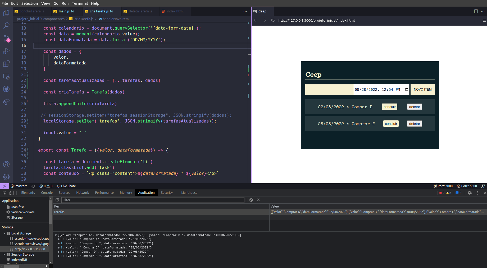
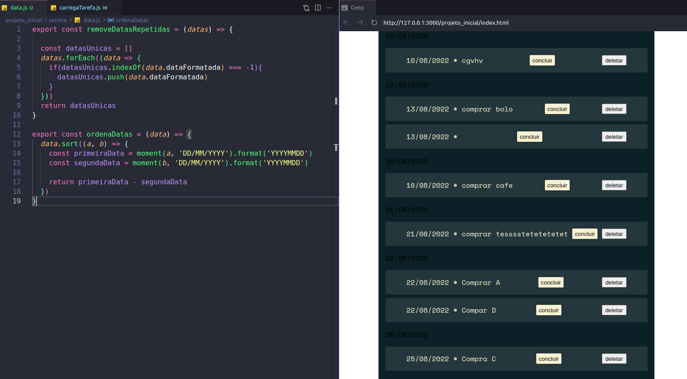
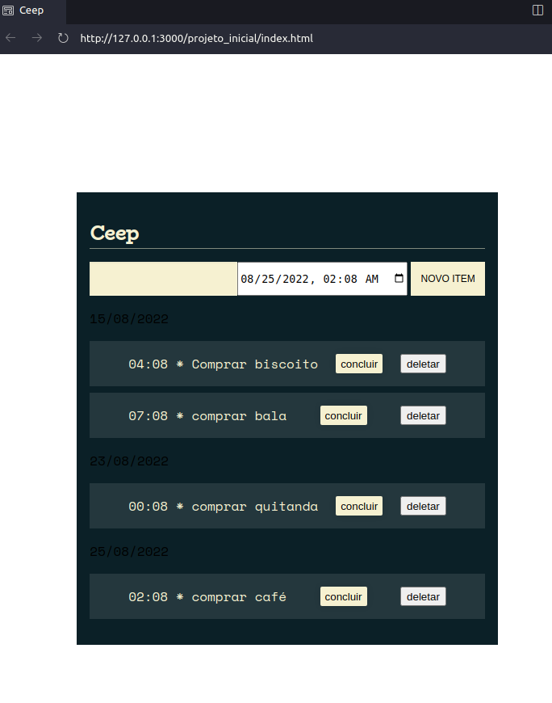

# Curso de JS na Web: Armazenando dados no navegador

#### Faça esse curso de JavaScript e:

- Aprenda como funciona a API de armazenamento

- Manipule o Local Storage para guardar dados

- Trabalhe com datas no JavaScript

- Utilize o sistema de módulos do JavaScript para proteger os arquivos

**INSTRUTOR:** Felipe Nascimento

### 01. Trabalhando com datas

Nesta aula, aprendemos a:

- Utilizar componente de calendário

- Manipular datas

- Desestruturar objetos em JavaScript

### 02. LocalStorage

Nesta aula, aprendemos a:

- Salvar dados no navegador utilizando SessionStorage

- Armazenar dados sem encerrar a sessão com e LocalStorage

- Transformar objetos em string utilizando JSON.stringify()

### 03. Renderizando a lista 

Nesta aula, aprendemos a:

- Iterar sobre os itens do LocalStorage

- Utilizar o curto circuito para verificação lógica

- Converter os itens que antes eram strings em objetos com JSON.parse

### 04. Ordenando as tarefas 

Nesta aula, aprendemos a:

- Filtrar elementos de um array

- Ordenar elementos do LocalStorage

### 05. Finalizando o projeto

Nesta aula, aprendemos a:

- Alterar um estado utilizando operador de negação

- Remover dados do LocalStorage utilizando o método splice

